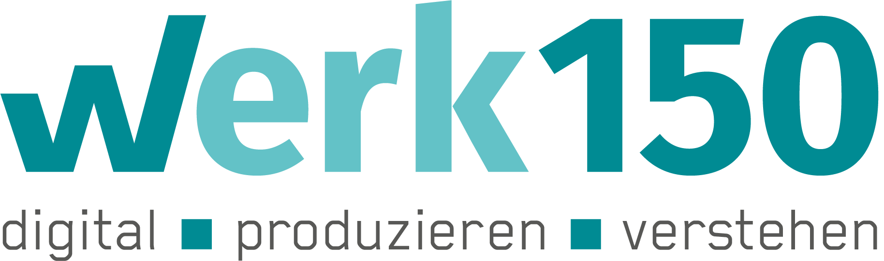

## KI Sprachtec

Forschung zur Weiterentwicklung der KI-basierten, skalierbaren und halluzinationsfreien Textautomatisierung aus strukturierten Daten.

 

Gef&ouml;rdert durch:

 

<em>Nutzen Sie die Pfeiltasten Ihrer Tastatur zur Navigation.</em>

Eine Kollaboration von 
 
und dem

der Hochschule Reutlingen
<!---

  

    
    
  

-->

 

Projektlaufzeit: 08/2022 &mdash; 12/2024

Projektziel: Entwicklung KI-basierter Sprachtechnologien, die die bestehenden Möglichkeiten automatisierter Texterstellung innovativ weiterentwickeln. 

- **Weiterentwicklung der KI-basierten automatisierten Texterstellung und -Übersetzung**:  
   Entwicklung einer Lösung, die in der Lage ist, aus strukturierten Daten skalierbar und automatisiert hochwertige Texte zu generieren und in über 110 Sprachen zu übersetzen, um repetitive und kostenintensive Schreibaufgaben effizient zu erledigen.

- **Dynamische Personalisierung und selbstlernende Texte**:  
   Implementierung dynamischer Personalisierung von Inhalten und automatisierter Erfolgsmessung der Texte, sodass Inhalte individuell auf Zielgruppen und Anwendungsfälle angepasst und optimiert werden können.

Anwendungsfälle reichen von der automatisierten Betextung von Produktdetailseiten im eCommerce über die Generierung von Business-Reports bis hin zu dynamischen Arbeitsanweisungen in Smart-Factories.

Ergebnisse Technologieentwicklung: Die technologischen Ergebnisse in KI Sprachtec ermöglichen eine Skalierbarkeit der Textautomatierung, die mit Lösung wie ChatGPT allein nicht möglich ist.

- **KI-unterstützte automatisierte Texterstellung ohne Halluzinationen**:
   Durch die Synergie aus KI, speziellen Regelwerken und einem neuen Human-in-the-Loop-Ansatz können Texte für viele Tausend Produktvarianten automatisiert generiert werden, ohne dass die erstellten Texte kontrolliert werden müssen. Die Automatisierung skaliert also, ohne dass die menschliche Arbeit mit skalieren muss. Damit setzt sich „KI Sprachtec“ deutlich von halluzinationsanfälligen Lösungen wie ChatGPT ab.

- **Automatisierte Übersetzung in bis zu 110 Sprachen**:
   Dank eigens entwickelter, auf Grammatik spezialisierter neuronaler Netzwerke muss eine Übersetzung nur einmal auf Ebene der Regelwerke erfolgen, und schon können Tausende von Übersetzungen automatisiert werden, ohne die generierten Texte kontrollieren zu müssen.

- **Dynamisierung personalisierter Inhalte und selbstlernende Texte**:
   Durch eine Erfolgsmessung der generierten Texte können die erhobenen Daten in Feedbackschleifen in die automatisierte Textproduktion zurückgeführt werden. Damit können die Texte laufend verbessert werden.

Ergebnisse Marktforschung: Während des Projekts wurde intensiv Marktforschung betrieben und deren Ergebnisse laufend in die technologische Entwicklung integriert.

Aus der Marktforschung wurden die folgenden Artefakte gewonnen:
- **Optimierte Prozesse für automatisierte Texterstellung und Datenmanagement**:
   Die entwickelten Technologien erfordern ein Neudenken der bisherigen Schreib- und Redaktionsprozesse, um das Effizientspotenzial voll auszunutzen. Dabei muss auch das Datenmanagement berücksichtigt werden.

- **E-Learning zur notwendigen Transformation von Textautomatisierung und Datenmanagement**:
   Die optimierten Prozesse wurden in E-Learning Materialien überführt, die die Transformation des Schreib- und Redaktionsprozesse von den Rohdaten, über die Text-Konzeption, Text-Composition, Text-Generierung & -Übersetzung, bis hin zur Text Dynamisierung & Optimierung begleitet.

- **Leuchtturm-Implementierungen der entwickelten Lösungen in realen Umsetzungsprojekten**:
   Während des Projekts wurden mehrere erfolgreiche Leuchtturm-Projekte durchgeführt, um die entwickelten Lösungen im realen Umfeld und unter verschiedenen Bedingungen zu testen. Die gesammelten Erfahrungen konnten sowohl in die technologischen Entwicklung als auch in die Prozessoptimierung und E-Learning Materialien überführt werden.

<!---
Ergebnisse Technologieentwicklung: 
Die zentralen technologischen Ergebnisse in KI Sprachtec 
<section>
  

    

      
KI-unterst&uuml;tzte automatisierte Texterstellung und -optimierung ohne Halluzinationen

    

    

      
Automatisierte Textgenerierung in 110 Sprachen

    

    

      
Messung der Textwirkung mit Feedbackschleifen in die Texterstellung und -optimierung

    

  

</section>
-->

<!---
Ergebnisse Daten: 
Gute Daten sind die Grundlage f&uuml;r gute Texte!

<section style="margin-top: 30px;">
  

    

      
Vielen Unternehmen fehlt ein strukturiertes Datenmanagement, um KI effektiv einzusetzen

    

    

      
Eine Optimierung der Kreislaufwirtschaft am Ende jedes Nutzungszyklusses ist ohne sutrukturiertes Datenmanagent nicht m&ouml;glich

    

    

      
Die Integration von Produktdaten, Zusammensetzung von Produkten, Herkunft einzelner Komponenten und spezifische Produkteigenschaften ist von zentraler Bedeutung für den effektive Einsatz von KI

    

    

      
Der Digitale Produktpass (DPP) und Standards wie die Asset Administration Shell (AAS) erm&ouml;glichen, Produktdaten strukturiert und interoperabel &uuml;ber den gesamten Produktlebenszyklus zu verwalten

    

  

</section>
-->
